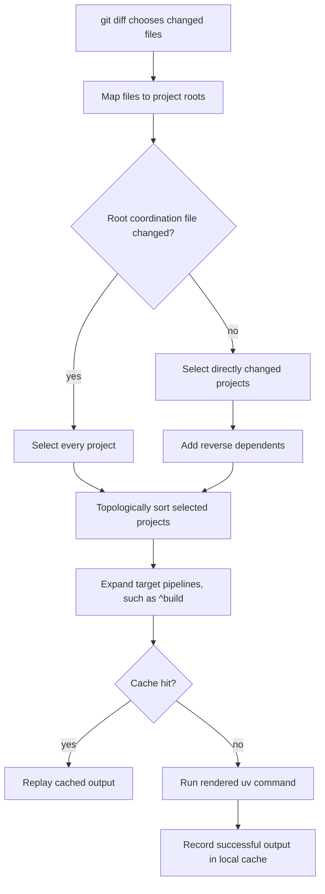

# Joist

A tiny, opinionated Python monorepo framework built around `uv`.

Joist borrows a few proven ideas from Nx and Lerna without trying to become
their Python clone:

- a project graph built from workspace packages
- named targets such as `test`, `lint`, and `build`
- dependency-aware task ordering
- changed-project selection based on `git diff`
- a small local task cache
- fixed-version releases for public packages

## Quickstart

```sh
uvx joist init demo
cd demo
uvx joist new lib core
uvx joist new app api --depends-on core
uvx joist graph
uvx joist run test
uvx joist run test --since main
uvx joist version patch --dry-run
```

This creates a uv workspace with one library, one app, an editable internal
workspace dependency from `api` to `core`, and graph-aware Joist targets.

If Joist is installed in the current environment, the console command is
available directly:

```sh
joist list
joist list --since origin/main
joist run test --since origin/main
```

## Python support

Joist supports Python 3.11 through 3.14. The minimum is Python 3.11 because
Joist uses the standard-library `tomllib` module for TOML parsing.

## Opinionated layout

`joist init` creates this shape:

```text
.
|-- apps/
|-- packages/
|-- joist.toml
`-- pyproject.toml
```

Projects live in `apps/*` or `packages/*`, each with its own `pyproject.toml`.
The root `pyproject.toml` owns the uv workspace; Joist treats that as the
package source of truth whenever possible. Joist uses uv workspace membership to
discover packages, uv workspace sources to keep internal dependencies editable,
and uv commands to sync, test, build, and publish. Joist only adds graph-aware
task orchestration on top:

```toml
[tool.uv]
package = false

[tool.uv.workspace]
members = ["packages/*", "apps/*"]
```

## Configuration

`joist.toml` defines project globs and target defaults:

```toml
[workspace]
projects = ["packages/*", "apps/*"]
default_base = "main"
cache_dir = ".joist/cache"

[target_defaults.test]
command = "uv run --package {package_name} pytest {project_root}/tests"
cache = true
inputs = ["{project_root}/src/**/*.py", "{project_root}/tests/**/*.py", "{project_root}/pyproject.toml", "pyproject.toml", "uv.lock"]

[target_defaults.build]
command = "uv build --package {package_name}"
cache = false
depends_on = ["^build"]
```

Target command templates support:

- `{workspace_root}`
- `{project_root}`
- `{project_name}`
- `{package_name}`

Commands are split with Python's `shlex` and executed without a shell. Use an
explicit shell command such as `sh -c "..."` only when shell syntax is required.

Each project can override or add targets in its own `pyproject.toml`:

```toml
[tool.joist]
name = "api"
type = "app"
depends_on = ["core"]

[tool.joist.targets.serve]
command = "uv run --package api python -m api"
cache = false
```

Internal dependencies are inferred from `[project].dependencies` when a
dependency name matches another workspace package. In uv, workspace-member
dependencies should also be declared with `tool.uv.sources`:

```toml
[project]
dependencies = ["core==0.1.0"]

[tool.uv.sources]
core = { workspace = true }
```

Explicit `depends_on` is available for task-ordering edges that are not package
dependencies.

## Changed-project selection

`--since` follows the same broad shape as Lerna and Nx affected runs: Git decides
which files changed, Joist maps those files onto workspace projects, then the
project graph pulls in dependents that also need validation.



Built-in root coordination files are `joist.toml`, root `pyproject.toml`, and
`uv.lock`. Add repo-specific shared files with `workspace.affects_all`:

```toml
[workspace]
affects_all = [
  ".github/workflows/**",
  "Makefile",
  "requirements*.txt",
  "ruff.toml",
  "scripts/**",
]
```

## Commands

```sh
uv run joist list
uv run joist list --since origin/main --json
uv run joist list --since origin/main --project api
uv run joist graph --format dot
uv run joist run build api
uv run joist run lint --dry-run
uv run joist run test --since origin/main
uv run joist run test --since origin/main --project api
uv run joist cache clear
uv run joist version minor
```

Default `run` commands skip projects that do not define the target. Explicit
project filters such as `--project api` are strict and fail if that project does
not define the target.

`affected` remains as a compatibility spelling for older workflows:

```sh
uv run joist affected --list --base origin/main --head HEAD --json
uv run joist affected test --base origin/main --head HEAD
```

`depends_on = ["^build"]` means "run the `build` target for dependency projects
before this project." This is the one Nx-style target pipeline rule Joist
supports.

The cache is deliberately simple. It hashes configured input files, the rendered
command, and extra CLI args, then replays cached terminal output for successful
runs. It does not implement remote cache or artifact restoration, so generated
build targets are intentionally uncached by default.

## Build system integration

Treat `joist.toml` targets as the contract between the monorepo and your build
system. Keep the target commands uv-native, then have CI or local automation call
Joist to decide which projects need each target.

For pull requests, fetch enough Git history for the base comparison and run only
changed targets:

```yaml
name: ci

on:
  pull_request:

jobs:
  changed:
    runs-on: ubuntu-latest
    env:
      BASE_REF: ${{ github.base_ref }}
    steps:
      - uses: actions/checkout@34e114876b0b11c390a56381ad16ebd13914f8d5 # v4.3.1
        with:
          fetch-depth: 0
      - uses: astral-sh/setup-uv@d4b2f3b6ecc6e67c4457f6d3e41ec42d3d0fcb86 # v5.4.2
      - run: uv sync --locked
      - run: uv run joist list --since "origin/${BASE_REF}" --json
      - run: uv run joist run lint --since "origin/${BASE_REF}"
      - run: uv run joist run test --since "origin/${BASE_REF}"
      - run: uv run joist run build --since "origin/${BASE_REF}"
```

For main-branch validation or nightly builds, run the complete target set:

```yaml
name: full-build

on:
  push:
    branches: [main]

jobs:
  build:
    runs-on: ubuntu-latest
    steps:
      - uses: actions/checkout@34e114876b0b11c390a56381ad16ebd13914f8d5 # v4.3.1
      - uses: astral-sh/setup-uv@d4b2f3b6ecc6e67c4457f6d3e41ec42d3d0fcb86 # v5.4.2
      - run: uv sync --locked
      - run: uv run joist run lint
      - run: uv run joist run test
      - run: uv run joist run build
```

For Make-based workflows, delegate the selection logic to Joist instead of
duplicating package lists:

```makefile
.PHONY: lint test build since-test clean-cache

lint:
	uv run joist run lint

test:
	uv run joist run test

build:
	uv run joist run build

since-test:
	uv run joist run test --since origin/main

clean-cache:
	uv run joist cache clear
```

For release pipelines, keep versioning explicit and build every public package
after the bump:

```sh
uv sync --locked
uv run joist version patch
uv lock
uv run joist run build --no-cache
```

Before uploading, run the local PyPI readiness checks:

```sh
uv run pytest
uv run ruff check .
rm -rf dist
uv build
uv run twine check dist/*
uv publish --dry-run --trusted-publishing never
```

Joist does not publish packages for you. Keep publishing as a separate,
auditable step using the uv command and credentials your release system already
controls.

For public PyPI publishing, verify the distribution name immediately before the
first upload.

## Release model

Joist uses one Lerna-inspired release mode: fixed versions. `joist version
patch` bumps every non-private workspace project to the same version and writes a
root `VERSION` file. Internal dependency pins that point at public workspace
packages are updated too, including pins in private projects.

Mark private projects with:

```toml
[tool.joist]
private = true
```

## Design boundaries

Joist is intentionally not a plugin ecosystem, not a remote cache service, and
not a Python package publisher. `uv` owns workspace membership, locking, syncing,
editable internal dependencies, building, and publishing. Joist is a small task
orchestration layer over `uv`, `git`, and project-local commands.

## License

Joist is licensed under the Universal Permissive License 1.0 (`UPL-1.0`).
